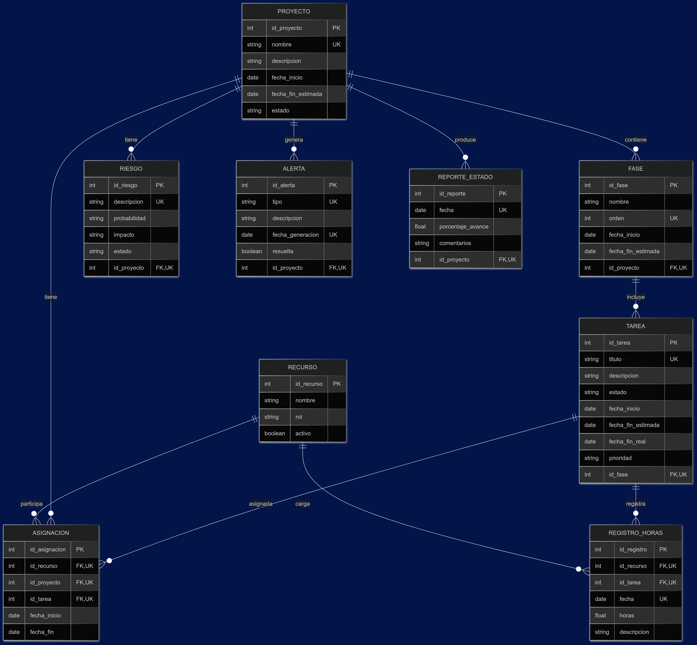

# Diseño de Base de Datos - Módulo Proyectos

El presente diseño relacional se desarrolló a partir del modelo de dominio y los requisitos funcionales específicos del módulo **Proyectos** del sistema PSA. Tiene como objetivo garantizar la integridad de los datos, facilitar el seguimiento del ciclo de vida de los proyectos y dar soporte a funcionalidades clave como la planificación, asignación de tareas, gestión de riesgos y carga de horas.
En la siguiente imagen se mostrará la base de datos diseñada.

## Diagrama

### Estructura General

El modelo contempla las siguientes entidades principales:

* **PROYECTO**: Contiene los datos generales de cada proyecto (identificador, nombre, fechas, estado, etc.).
* **FASE**: Representa las etapas o iteraciones del proyecto, permitiendo un orden de ejecución y planificación temporal.
* **TAREA**: Corresponde a las unidades mínimas de trabajo dentro de una fase.
* **RECURSO**: Representa al personal que participa en los proyectos, incluyendo su rol y estado.
* **ASIGNACION**: Permite vincular recursos a proyectos y tareas, indicando el período de trabajo asignado.
* **REGISTRO\_HORAS**: Permite el registro detallado de horas trabajadas por los recursos sobre tareas específicas.
* **RIESGO**: Contempla los riesgos identificados para un proyecto, su impacto, probabilidad y estado.
* **ALERTA**: Avisa sobre eventos relevantes como vencimientos, riesgos activos u otros factores críticos.
* **REPORTE\_ESTADO**: Almacena reportes periódicos del estado del proyecto, con su fecha, porcentaje de avance y observaciones.

### Justificación de Relaciones y Decisiones de Modelado

* Las **relaciones jerárquicas** entre proyecto–fase–tarea permiten una representación estructurada del ciclo de vida del proyecto.
* Se definió una **entidad específica para asignaciones** entre recursos, tareas y proyectos, para brindar mayor flexibilidad y control sobre la planificación y ejecución.
* La entidad **REGISTRO\_HORAS** permite reflejar el esfuerzo real registrado por los recursos, cumpliendo con requisitos como la trazabilidad del trabajo (P-3, P-3.1).
* El diseño incluye **soporte explícito para gestión de riesgos** y generación de alertas, en línea con los requisitos P-5 a P-5.3.1.
* La incorporación de **reportes de estado periódicos** (P-4) permite monitorear el progreso y registrar observaciones clave sobre cada proyecto.

### Restricciones de Integridad

Además de las claves primarias y foráneas, se contemplan restricciones de unicidad (UK) a nivel lógico y de base de datos, que permiten evitar inconsistencias y duplicaciones. Estas restricciones incluyen:

| Entidad          | Restricción de unicidad lógica                                   |
| ---------------- | ---------------------------------------------------------------- |
| `PROYECTO`       | `nombre` único                                                   |
| `FASE`           | combinación de (`id_proyecto`, `orden`) única                    |
| `TAREA`          | combinación de (`id_fase`, `titulo`) única                       |
| `ASIGNACION`     | combinación de (`id_recurso`, `id_proyecto`, `id_tarea`) única   |
| `REGISTRO_HORAS` | combinación de (`id_recurso`, `id_tarea`, `fecha`) única         |
| `RIESGO`         | combinación de (`id_proyecto`, `descripcion`) única              |
| `ALERTA`         | combinación de (`id_proyecto`, `tipo`, `fecha_generacion`) única |
| `REPORTE_ESTADO` | combinación de (`id_proyecto`, `fecha`) única                    |

En el diagrama del diseño, cuando se ponen UK, se las plantea como una clave candidata única, es decir, la combinación de los atributos marcados como UK es única.
