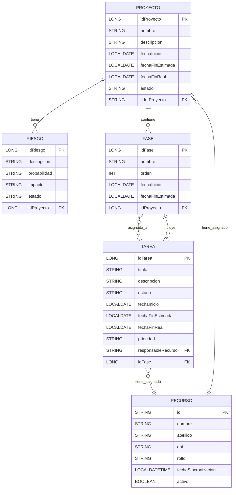

# Diseño de Base de Datos - Módulo Proyectos

El presente diseño relacional se desarrolló a partir del modelo de dominio y los requisitos funcionales específicos del módulo **Proyectos** del sistema PSA. Tiene como objetivo garantizar la integridad de los datos, facilitar el seguimiento del ciclo de vida de los proyectos y dar soporte a funcionalidades clave como la planificación, asignación de tareas, gestión de riesgos y carga de horas.
A continuación, se presenta el diagrama de la base de datos en formato Mermaid:

## Diagrama

### Estructura General

El modelo contempla las siguientes entidades principales:

* **PROYECTO**: Contiene los datos generales de cada proyecto (identificador, nombre, fechas, estado, etc.).
* **FASE**: Representa las etapas o iteraciones del proyecto, permitiendo un orden de ejecución y planificación temporal.
* **TAREA**: Corresponde a las unidades mínimas de trabajo dentro de una fase.
* **RECURSO**: Representa al personal que participa en los proyectos, incluyendo su rol y estado. Son obtenidos mediante conexión de API.
* **RIESGO**: Contempla los riesgos identificados para un proyecto, su impacto, probabilidad y estado.

### Justificación de Relaciones y Decisiones de Modelado

* Las **relaciones jerárquicas** entre proyecto–fase–tarea permiten una representación estructurada del ciclo de vida del proyecto.
* Se definió una relación directa entre tareas y recursos, donde cada tarea tiene asignado un único responsable, y un recurso puede ser responsable de múltiples tareas.
* Se vincula cada proyecto con un único líder mediante una relación directa con la entidad RECURSO.
* El diseño incluye **soporte explícito para gestión de riesgos**, en línea con los requisitos P-5 a P-5.3.1.

### Restricciones de Integridad

Además de las claves primarias y foráneas, se contemplan restricciones de unicidad (UK) a nivel lógico y de base de datos, que permiten evitar inconsistencias y duplicaciones. Estas restricciones incluyen:

| Entidad    | Restricción de unicidad lógica                      |
| ---------- | --------------------------------------------------- |
| `PROYECTO` | `nombre` único                                      |
| `FASE`     | combinación de (`id_proyecto`, `orden`) única       |
| `TAREA`    | combinación de (`id_fase`, `titulo`) única          |
| `RIESGO`   | combinación de (`id_proyecto`, `descripcion`) única |

En el diagrama del diseño, cuando se indican UK, se las plantea como una clave candidata única, es decir, la combinación de los atributos marcados como UK es única.
