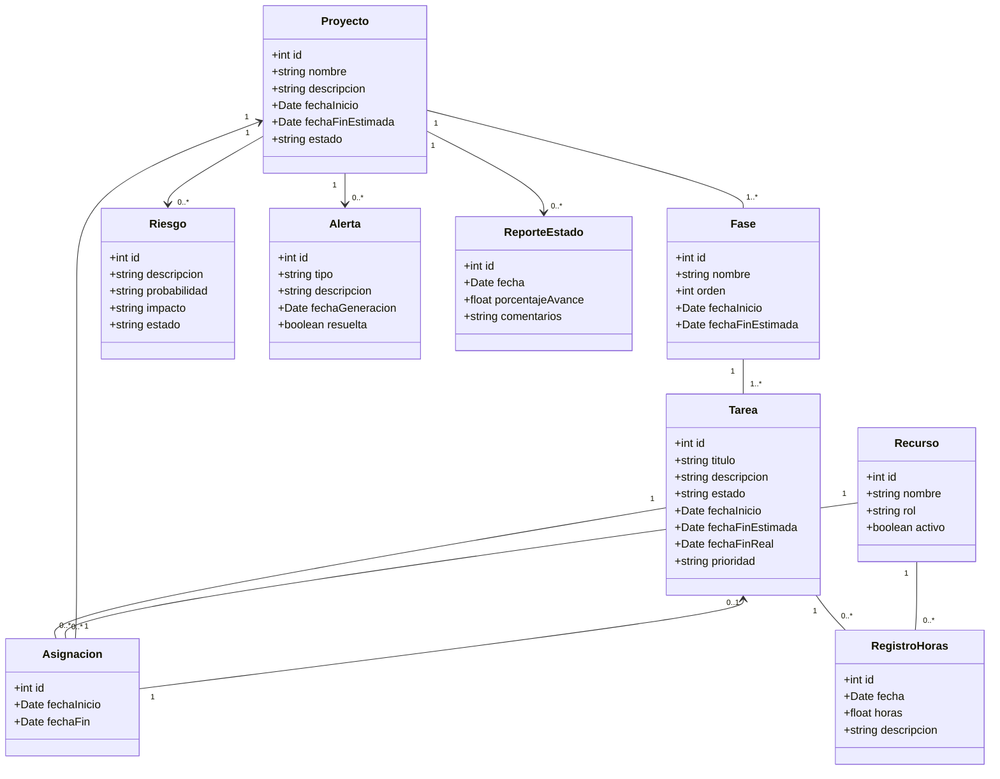

# Diagrama de Clases – Módulo Proyectos 

El siguiente diagrama de clases representa la estructura de datos y relaciones del módulo de **Proyectos** del sistema PSA. Se basa en el modelo de dominio y en los requisitos funcionales relevados en entrevistas con los distintos interesados. El objetivo es modelar las entidades clave involucradas en la gestión de proyectos, tareas, fases, recursos y el seguimiento del avance.

## Diagrama de Clases

## Justificación de Relaciones

| Relación                     | Flecha | Justificación                                                                        |
| ---------------------------- | ------ | ------------------------------------------------------------------------------------ |
| **Proyecto - Fase**          | `--`   | Cada fase pertenece a un proyecto. El proyecto tiene una o más fases.                |
| **Fase - Tarea**             | `--`   | Cada tarea pertenece a una fase. La fase contiene múltiples tareas.                  |
| **Proyecto - Riesgo**        | `-->`  | Cada riesgo está asociado a un proyecto.                                             |
| **Proyecto - Alerta**        | `-->`  | Las alertas se generan en contexto de un proyecto.                                   |
| **Proyecto - ReporteEstado** | `-->`  | Cada reporte refleja el estado de un proyecto en una fecha determinada.              |
| **Tarea - Asignación**       | `--`   | Las tareas pueden tener múltiples asignaciones de recursos.                          |
| **Recurso - Asignación**     | `--`   | Un recurso puede participar en múltiples asignaciones.                               |
| **Asignación - Proyecto**    | `-->`  | Cada asignación está relacionada a un proyecto.                                      |
| **Asignación - Tarea**       | `-->`  | Puede haber asignaciones a tareas específicas dentro de un proyecto.                 |
| **Tarea - RegistroHoras**    | `--`   | Las tareas tienen registros de horas trabajadas por parte de los recursos asignados. |
| **Recurso - RegistroHoras**  | `--`   | Cada recurso puede tener múltiples registros de horas en diferentes tareas.          |

## Consideraciones

* Este diagrama está enfocado en el **modelo de dominio** y la **estructura de datos**. Por ese motivo, **no incluye métodos ni lógica de negocio**.
* Las relaciones se modelan con cardinalidades lo suficientemente amplias para cubrir distintos estados del sistema (por ejemplo: proyectos recién creados sin tareas, tareas sin asignaciones aún, etc.).
