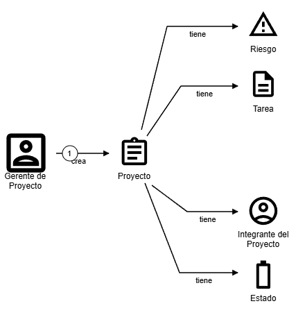
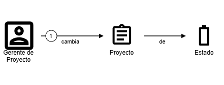
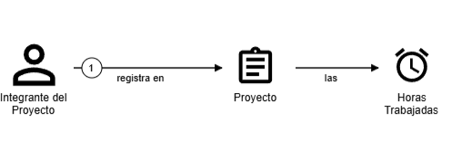
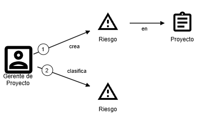

# Historias de Dominio – Módulo de Proyectos

Este documento presenta las **historias de dominio** correspondientes al Módulo de Proyectos, derivadas de la matriz de trazabilidad disponible en el archivo [`requisitos.md`](../Requisitos/requisitos.md). Estas historias permiten describir, desde una perspectiva centrada en el negocio y el dominio, los conceptos y comportamientos fundamentales del sistema, sin entrar en detalles de interfaz ni implementación técnica.

## Historias de Dominio

### HD-01: Proyecto y sus atributos

* **Contexto:** Todo proyecto en el sistema tiene asociada una serie de datos que permiten identificarlo, gestionarlo y hacer seguimiento.
* **Hecho Relevante:** Los proyectos se identifican por un ID, tienen nombre, descripción, fechas de inicio y fin (estimada y real), estado, riesgos asociados, un líder responsable, tareas estimadas y reales, y fases.
* **Impacto:** Permite representar el concepto de "proyecto" con todas sus propiedades necesarias para la planificación y control.
* **Requisitos Asociados:** P-4, P-9, P-9.1, P-6, P-7, P-8, P-9, P-9.1
* **Historias de Usuario Asociadas:** US-01, US-04, US-05, US-06

---

### HD-02: Etapas del Proyecto

* **Contexto:** Los proyectos siguen un ciclo de vida definido.
* **Hecho Relevante:** Cada proyecto atraviesa tres estados: Cerrados, Activos y Pausados.
* **Impacto:** Define el flujo de trabajo del proyecto e influye en qué acciones se pueden realizar según el estado.
* **Requisitos Asociados:** P-2
* **Historias de Usuario Asociadas:** US-02

---

### HD-03: Carga de horas y control

* **Contexto:** Los integrantes de un proyecto registran el tiempo dedicado a las actividades.
* **Hecho Relevante:** Cada integrante puede cargar horas trabajadas en un proyecto, salvo que el proyecto esté finalizado. Además, existen restricciones de permisos.
* **Impacto:** Provee información crítica para el control de avance y costos del proyecto.
* **Requisitos Asociados:** P-3, P-3.1, P-10
* **Historias de Usuario Asociadas:** US-03

---

### HD-04: Identificación y gestión de riesgos

* **Contexto:** La identificación temprana de riesgos es clave para la gestión eficaz del proyecto.
* **Hecho Relevante:** Cada riesgo puede ser clasificado por impacto y probabilidad. Puede tener planes de mitigación y contingencia asignados, con responsables definidos. Los riesgos deben poder visualizarse y priorizarse.
* **Impacto:** Mejora la capacidad del sistema para anticipar problemas y actuar proactivamente.
* **Requisitos Asociados:** P-5, P-5.1, P-5.2, P-5.2.1, P-5.3, P-5.3.1, P-10
* **Historias de Usuario Asociadas:** US-04

---

## Consideraciones Finales

Estas historias de dominio fueron elaboradas a partir de la matriz de trazabilidad del módulo de Proyectos y las historias de usuario ya existentes (US-01 a US-06). Sirven de base para el modelado del dominio y permiten al equipo comprender mejor los conceptos fundamentales que atraviesan al módulo de Proyectos.
