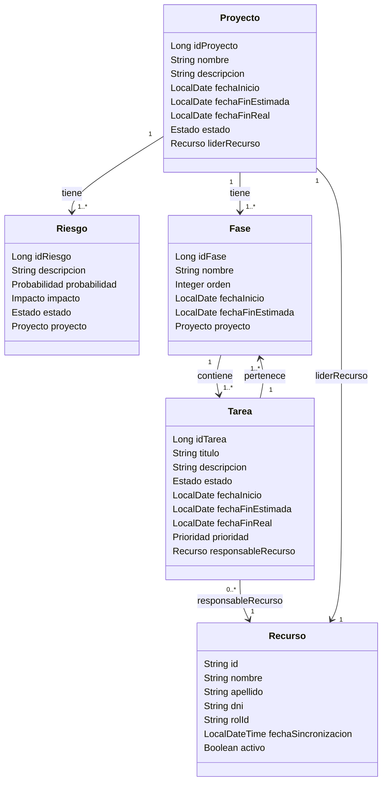
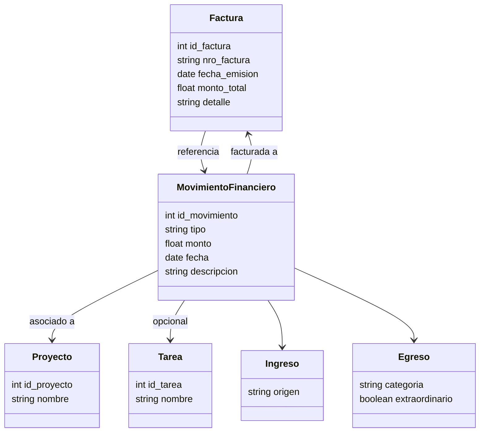
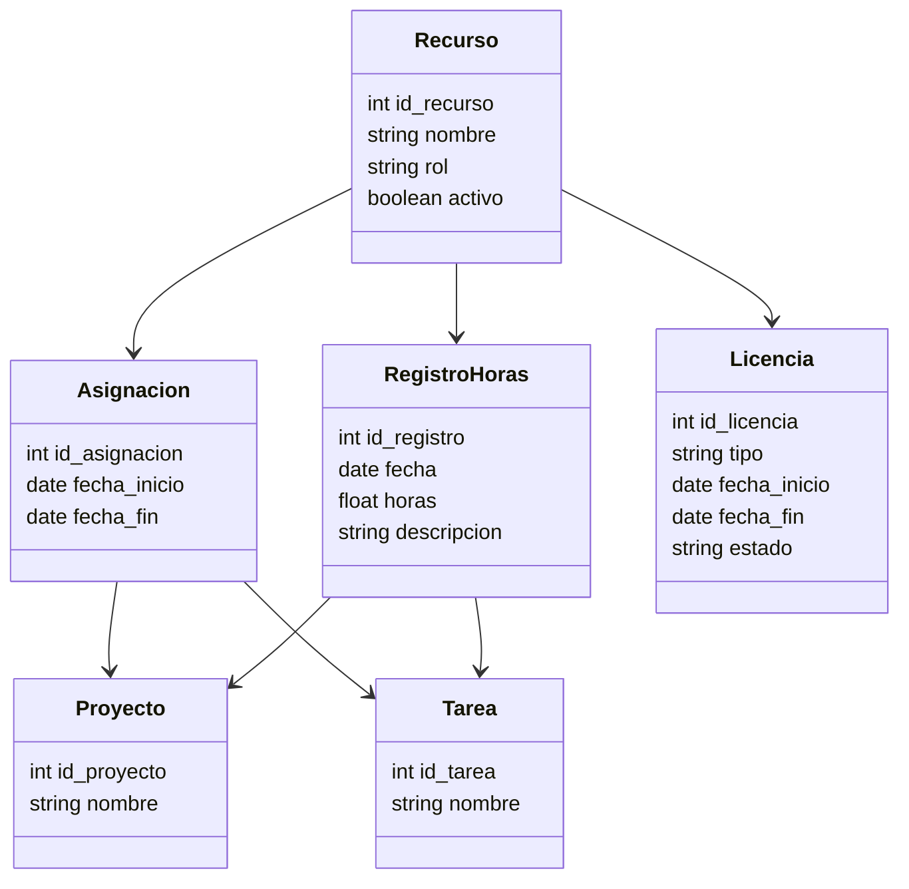
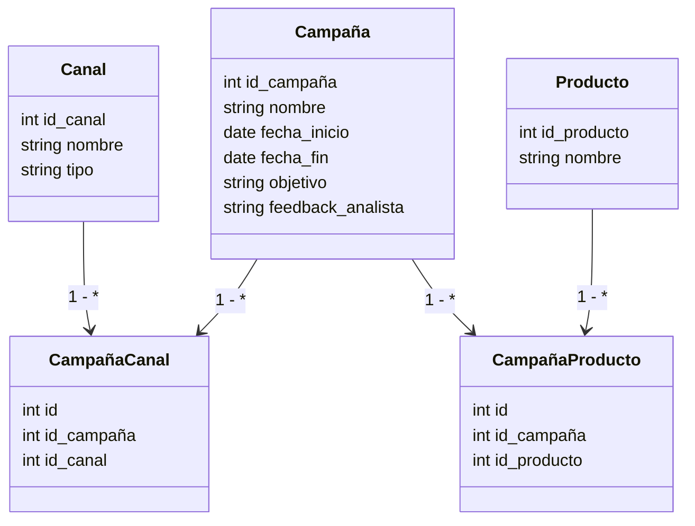
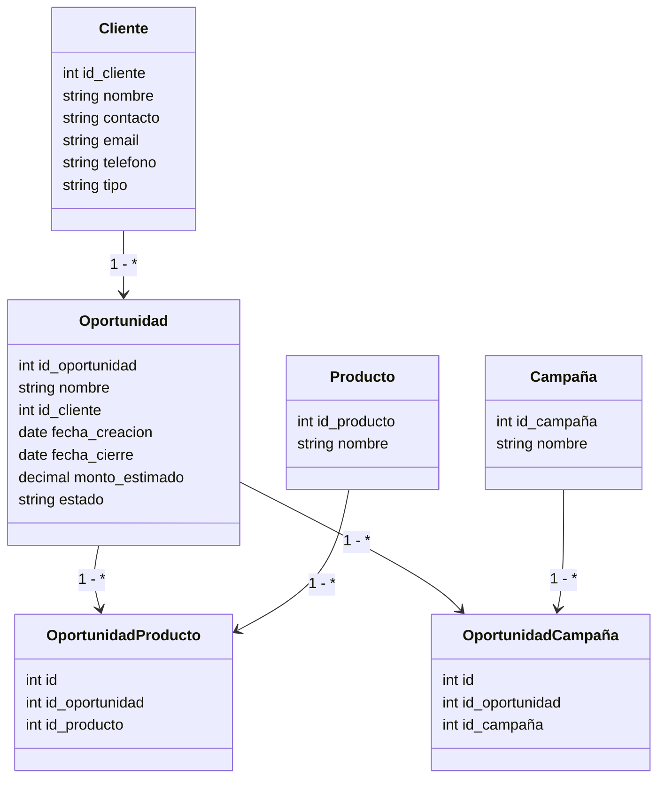

# Modelo de Dominio: Por Módulos

## Módulo: Proyectos

### Entidad: Proyecto

| Campo | Tipo de Dato | Restricciones | Descripción |
|-------|-------------|---------------|-------------|
| idProyecto | Long | PK, obligatorio | Identificador único del proyecto |
| nombre | String | Obligatorio | Nombre del proyecto |
| descripcion | String | Opcional | Descripción general del proyecto |
| fechaInicio | LocalDate | Obligatorio | Fecha de inicio del proyecto |
| fechaFinEstimada | LocalDate | Opcional | Fecha estimada de finalización |
| fechaFinReal | LocalDate | Opcional | Fecha real de finalización |
| estado | Estado | Obligatorio, enum | Estado del proyecto |
| liderRecurso | Recurso | FK → Recurso, obligatorio | Líder del proyecto |

### Entidad: Fase

| Campo | Tipo de Dato | Restricciones | Descripción |
|-------|-------------|---------------|-------------|
| idFase | Long | PK, obligatorio | Identificador único de la fase |
| nombre | String | Obligatorio | Nombre de la fase o iteración |
| orden | Integer | Obligatorio | Número de orden de ejecución |
| fechaInicio | LocalDate | Obligatorio | Inicio previsto de la fase |
| fechaFinEstimada | LocalDate | Opcional | Fin estimado de la fase |
| proyecto | Proyecto | FK → Proyecto, obligatorio | Proyecto al que pertenece la fase |

### Entidad: Tarea

| Campo | Tipo de Dato | Restricciones | Descripción |
|-------|-------------|---------------|-------------|
| idTarea | Long | PK, obligatorio | Identificador único de la tarea |
| titulo | String | Obligatorio | Título o resumen corto de la tarea |
| descripcion | String | Opcional | Detalle de la tarea |
| estado | Estado | Obligatorio, enum | Estado actual de la tarea |
| fechaInicio | LocalDate | Obligatorio | Fecha de inicio planificada |
| fechaFinEstimada | LocalDate | Obligatorio | Fecha esperada de finalización |
| fechaFinReal | LocalDate | Opcional | Fecha real de finalización |
| prioridad | Prioridad | Opcional, enum | Prioridad asignada |
| responsableRecurso | Recurso | FK → Recurso, obligatorio | Recurso responsable de la tarea |

### Entidad: Riesgo

| Campo | Tipo de Dato | Restricciones | Descripción |
|-------|-------------|---------------|-------------|
| idRiesgo | Long | PK, obligatorio | Identificador único del riesgo |
| descripcion | String | Obligatorio | Descripción del riesgo identificado |
| probabilidad | Probabilidad | Obligatorio, enum | Probabilidad de ocurrencia |
| impacto | Impacto | Obligatorio, enum | Impacto potencial del riesgo |
| estado | Estado | Obligatorio, enum | Estado del riesgo |
| proyecto | Proyecto | FK → Proyecto, obligatorio | Proyecto al que pertenece el riesgo |

### Entidad: Recurso

| Campo | Tipo de Dato | Restricciones | Descripción |
|-------|-------------|---------------|-------------|
| id | String | PK, obligatorio | Identificador único del recurso |
| nombre | String | Obligatorio | Nombre del recurso |
| apellido | String | Obligatorio | Apellido del recurso |
| dni | String | Obligatorio | DNI del recurso |
| rolId | String | Obligatorio | Identificador del rol |
| fechaSincronizacion | LocalDateTime | Obligatorio | Fecha de última sincronización |
| activo | Boolean | Obligatorio | Indica si el recurso está activo |

### Relaciones

- **Proyecto** tiene múltiples **Riesgos** (1:N)
- **Proyecto** tiene múltiples **Fases** (1:N)
- **Fase** contiene múltiples **Tareas** (1:N)
- **Tarea** pertenece a una **Fase** (N:1)
- **Recurso** puede ser responsable de múltiples **Tareas** (1:N)
- **Proyecto** tiene un **Recurso** como líder (1:1)

---

## Módulo: Soporte -- falta actualizar

### Entidad: Ticket

| Campo | Tipo de Dato | Restricciones | Descripción |
|-------|-------------|---------------|-------------|
| id_ticket | Entero | PK, obligatorio | Identificador único del ticket |
| titulo | Texto | Obligatorio, máx. 100 | Título o resumen del ticket |
| descripcion | Texto | Opcional | Descripción detallada del incidente o solicitud |
| tipo | Texto | Obligatorio, valores predefinidos | Tipo de problema (Ej: Incidente, Consulta, Mejora) |
| prioridad | Texto | Obligatorio, valores predefinidos | Prioridad asignada (Alta, Media, Baja) |
| estado | Texto | Obligatorio | Estado actual (Ej: Abierto, En progreso, Cerrado) |
| fecha_creacion | Fecha | Obligatorio | Fecha en que se creó el ticket |
| fecha_vencimiento | Fecha | Opcional | Fecha límite estimada de resolución |
| fecha_cierre | Fecha | Opcional | Fecha en que se cerró el ticket |
| id_cliente | Entero | FK → Cliente | Cliente que reportó el ticket |
| id_producto | Entero | FK → Producto | Producto al que está asociado el ticket |
| id_creador | Entero | FK → Usuario | Usuario que registró el ticket |
| id_asignado | Entero | FK → Usuario | Usuario que está resolviendo el ticket |

### Entidad: Cliente

| Campo | Tipo de Dato | Restricciones | Descripción |
|-------|-------------|---------------|-------------|
| id_cliente | Entero | PK, obligatorio | Identificador único del cliente |
| nombre | Texto | Obligatorio | Nombre de la empresa o cliente interno |

### Entidad: Producto

| Campo | Tipo de Dato | Restricciones | Descripción |
|-------|-------------|---------------|-------------|
| id_producto | Entero | PK, obligatorio | Identificador único del producto |
| nombre | Texto | Obligatorio | Nombre del producto afectado |

### Entidad: Usuario

| Campo | Tipo de Dato | Restricciones | Descripción |
|-------|-------------|---------------|-------------|
| id_usuario | Entero | PK, obligatorio | Identificador único del usuario |
| nombre | Texto | Obligatorio | Nombre del usuario |
| rol | Texto | Obligatorio | Rol del usuario (Ej: Soporte, Analista, PO) |

### Entidad: Alerta

| Campo | Tipo de Dato | Restricciones | Descripción |
|-------|-------------|---------------|-------------|
| id_alerta | Entero | PK, obligatorio | Identificador único de la alerta |
| tipo | Texto | Obligatorio | Tipo de alerta (Ej: Vencimiento) |
| descripcion | Texto | Opcional | Descripción de la alerta |
| fecha_generacion | Fecha | Obligatorio | Fecha en que se generó la alerta |
| resuelta | Booleano | Obligatorio | Indica si la alerta fue resuelta o no |

### Entidad: HistorialTicket

| Campo | Tipo de Dato | Restricciones | Descripción |
|-------|-------------|---------------|-------------|
| id_historial | Entero | PK, obligatorio | Identificador único del registro |
| fecha | Fecha | Obligatorio | Fecha del evento registrado |
| detalle | Texto | Obligatorio | Comentario o descripción del evento |
| id_ticket | Entero | FK → Ticket | Ticket al que pertenece el historial |
| id_usuario | Entero | FK → Usuario | Usuario que hizo el registro |

---

## Módulo: Finanzas

### Entidad: MovimientoFinanciero

| Campo | Tipo de Dato | Restricciones | Descripción |
|-------|-------------|---------------|-------------|
| id_movimiento | Entero | PK, obligatorio | Identificador único del movimiento |
| tipo | Texto | Obligatorio, valores predefinidos | Tipo: Ingreso o Egreso |
| monto | Decimal | Obligatorio, > 0 | Monto del ingreso o egreso |
| fecha | Fecha | Obligatorio | Fecha del movimiento |
| descripcion | Texto | Opcional | Detalle adicional del movimiento |
| id_proyecto | Entero | FK → Proyecto | Proyecto al que se asocia el movimiento |
| id_tarea | Entero | FK → Tarea (opcional) | Tarea específica (si aplica) |

### Entidad: Ingreso (hereda de MovimientoFinanciero)

| Campo | Tipo de Dato | Restricciones | Descripción |
|-------|-------------|---------------|-------------|
| origen | Texto | Obligatorio | Fuente del ingreso (cliente, etc.) |

### Entidad: Egreso (hereda de MovimientoFinanciero)

| Campo | Tipo de Dato | Restricciones | Descripción |
|-------|-------------|---------------|-------------|
| categoria | Texto | Obligatorio | Ej: Sueldos, Servicios, Licencias |
| extraordinario | Booleano | Obligatorio | Indica si es un gasto fuera del presupuesto |

### Entidad: Factura

| Campo | Tipo de Dato | Restricciones | Descripción |
|-------|-------------|---------------|-------------|
| id_factura | Entero | PK, obligatorio | Identificador único de la factura |
| nro_factura | Texto | Obligatorio, único | Número oficial de la factura |
| fecha_emision | Fecha | Obligatorio | Fecha en que se emitió |
| monto_total | Decimal | Obligatorio | Monto total de la factura |
| detalle | Texto | Opcional | Descripción detallada |
| id_proyecto | Entero | FK → Proyecto | Proyecto al que corresponde la factura |

### Entidad: Proyecto

| Campo | Tipo de Dato | Restricciones | Descripción |
|-------|-------------|---------------|-------------|
| id_proyecto | Entero | PK, obligatorio | Identificador del proyecto |
| nombre | Texto | Obligatorio | Nombre del proyecto |

### Entidad: Tarea

| Campo | Tipo de Dato | Restricciones | Descripción |
|-------|-------------|---------------|-------------|
| id_tarea | Entero | PK, obligatorio | Identificador único de la tarea |
| nombre | Texto | Obligatorio | Nombre de la tarea |

---

## Módulo: Recursos

### Entidad: Recurso

| Campo | Tipo de Dato | Restricciones | Descripción |
|-------|-------------|---------------|-------------|
| id_recurso | Entero | PK, obligatorio | Identificador único del recurso humano |
| nombre | Texto | Obligatorio | Nombre y apellido |
| rol | Texto | Obligatorio | Rol asignado (desarrollador, analista, etc) |
| activo | Booleano | Obligatorio | Indica si el recurso está activo en PSA |

### Entidad: Asignacion

| Campo | Tipo de Dato | Restricciones | Descripción |
|-------|-------------|---------------|-------------|
| id_asignacion | Entero | PK, obligatorio | Identificador de la asignación |
| id_recurso | Entero | FK → Recurso | Recurso asignado |
| id_proyecto | Entero | FK → Proyecto | Proyecto en el que trabaja |
| id_tarea | Entero | FK → Tarea | Tarea específica (opcional si es a nivel proyecto) |
| fecha_inicio | Fecha | Obligatorio | Fecha de inicio de la asignación |
| fecha_fin | Fecha | Obligatorio | Fecha de fin de la asignación |

### Entidad: RegistroHoras

| Campo | Tipo de Dato | Restricciones | Descripción |
|-------|-------------|---------------|-------------|
| id_registro | Entero | PK, obligatorio | Identificador del registro de horas |
| id_recurso | Entero | FK → Recurso | Recurso que carga las horas |
| id_tarea | Entero | FK → Tarea | Tarea trabajada |
| fecha | Fecha | Obligatorio | Fecha del trabajo |
| horas | Decimal | Obligatorio, ≥ 0 | Cantidad de horas trabajadas |
| descripcion | Texto | Opcional | Detalle opcional del trabajo realizado |

### Entidad: Licencia

| Campo | Tipo de Dato | Restricciones | Descripción |
|-------|-------------|---------------|-------------|
| id_licencia | Entero | PK, obligatorio | Identificador de la licencia |
| id_recurso | Entero | FK → Recurso | Recurso que solicita la licencia |
| tipo | Texto | Obligatorio | Vacaciones, enfermedad, estudio, etc. |
| fecha_inicio | Fecha | Obligatorio | Inicio del período de licencia |
| fecha_fin | Fecha | Obligatorio | Fin del período de licencia |
| estado | Texto | Obligatorio | Pendiente, aprobada, rechazada |

### Entidad: Proyecto

| Campo | Tipo de Dato | Restricciones | Descripción |
|-------|-------------|---------------|-------------|
| id_proyecto | Entero | PK, obligatorio | Identificador del proyecto |
| nombre | Texto | Obligatorio | Nombre del proyecto |

### Entidad: Tarea

| Campo | Tipo de Dato | Restricciones | Descripción |
|-------|-------------|---------------|-------------|
| id_tarea | Entero | PK, obligatorio | Identificador único de tarea |
| nombre | Texto | Obligatorio | Nombre de la tarea |

---

## Módulo: Marketing

### Entidad: Campaña

| Campo | Tipo de Dato | Restricciones | Descripción |
|-------|-------------|---------------|-------------|
| id_campaña | Entero | PK, obligatorio | Identificador único de la campaña |
| nombre | Texto | Obligatorio | Nombre de la campaña |
| fecha_inicio | Fecha | Obligatorio | Fecha de inicio de la campaña |
| fecha_fin | Fecha | Obligatorio | Fecha de finalización de la campaña |
| objetivo | Texto | Opcional | Objetivo comercial o de posicionamiento |
| feedback_analista | Texto | Opcional | Comentarios y evaluaciones del analista de campaña |

### Entidad: Canal

| Campo | Tipo de Dato | Restricciones | Descripción |
|-------|-------------|---------------|-------------|
| id_canal | Entero | PK, obligatorio | Identificador único del canal |
| nombre | Texto | Obligatorio | Nombre del canal (Ej: Google Ads) |
| tipo | Texto | Obligatorio | Tipo de canal (SEO, SEM, Email, etc.) |

### Entidad: Producto

| Campo | Tipo de Dato | Restricciones | Descripción |
|-------|-------------|---------------|-------------|
| id_producto | Entero | PK, obligatorio | Identificador del producto o módulo |
| nombre | Texto | Obligatorio | Nombre del producto o servicio |

### Entidad: CampañaCanal (Tabla intermedia)

| Campo | Tipo de Dato | Restricciones | Descripción |
|-------|-------------|---------------|-------------|
| id | Entero | PK, obligatorio | Identificador de la relación |
| id_campaña | Entero | FK → Campaña | Campaña vinculada |
| id_canal | Entero | FK → Canal | Canal de difusión asociado |

### Entidad: CampañaProducto (Tabla intermedia)

| Campo | Tipo de Dato | Restricciones | Descripción |
|-------|-------------|---------------|-------------|
| id | Entero | PK, obligatorio | Identificador de la relación |
| id_campaña | Entero | FK → Campaña | Campaña vinculada |
| id_producto | Entero | FK → Producto | Producto o módulo asociado |

---

## Módulo: Ventas

### Entidad: Cliente

| Campo | Tipo | Restricciones | Descripción |
|-------|------|---------------|-------------|
| id_cliente | int | PK, autoincremental | Identificador único del cliente |
| nombre | string | obligatorio | Nombre o razón social del cliente |
| tipo | string | obligatorio, enum | Tipo de cliente: potencial, actual |
| contacto | string | opcional | Persona de contacto principal |
| email | string | opcional, formato email | Correo electrónico del cliente |
| telefono | string | opcional | Teléfono de contacto |

### Entidad: Oportunidad

| Campo | Tipo | Restricciones | Descripción |
|-------|------|---------------|-------------|
| id_oportunidad | int | PK, autoincremental | Identificador único de la oportunidad |
| nombre | string | obligatorio | Nombre descriptivo de la oportunidad |
| id_cliente | int | FK Cliente.id_cliente | Cliente al que pertenece la oportunidad |
| estado | string | obligatorio, enum | Estado actual de la oportunidad (ej: nuevo, cerrado) |
| fecha_creacion | date | obligatorio | Fecha de creación de la oportunidad |
| fecha_cierre | date | opcional | Fecha en la que se cerró la oportunidad |
| monto_estimado | decimal | opcional | Monto estimado de la venta |

### Entidad: Producto

| Campo | Tipo | Restricciones | Descripción |
|-------|------|---------------|-------------|
| id_producto | int | PK, autoincremental | Identificador único del producto |
| nombre | string | obligatorio | Nombre del producto |

### Entidad: Campaña

| Campo | Tipo | Restricciones | Descripción |
|-------|------|---------------|-------------|
| id_campaña | int | PK, autoincremental | Identificador único de la campaña |
| nombre | string | obligatorio | Nombre de la campaña |

### Entidad: OportunidadProducto

| Campo | Tipo | Restricciones | Descripción |
|-------|------|---------------|-------------|
| id | int | PK, autoincremental | Identificador único de la relación |
| id_oportunidad | int | FK Oportunidad.id_oportunidad | Oportunidad vinculada |
| id_producto | int | FK Producto.id_producto | Producto vinculado |

### Entidad: OportunidadCampaña

| Campo | Tipo | Restricciones | Descripción |
|-------|------|---------------|-------------|
| id | int | PK, autoincremental | Identificador único de la relación |
| id_oportunidad | int | FK Oportunidad.id_oportunidad | Oportunidad vinculada |
| id_campaña | int | FK Campaña.id_campaña | Campaña vinculada |