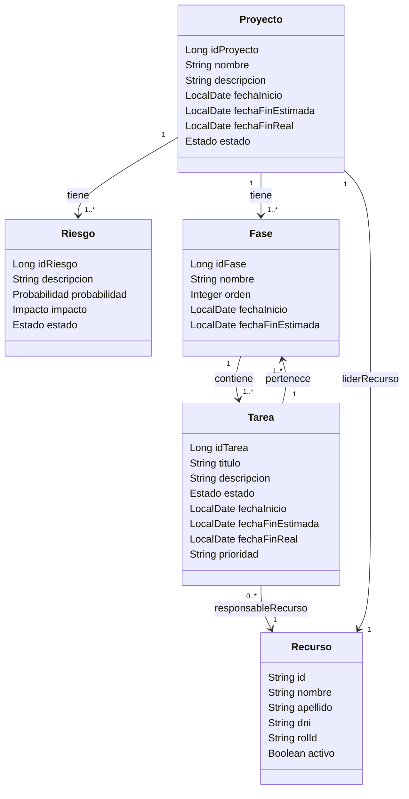

# Modelo de Dominio - Módulo de Proyecto

## Módulo: Proyectos

### Entidad: Proyecto

| Campo | Tipo de Dato | Restricciones | Descripción |
|-------|-------------|---------------|-------------|
| idProyecto | Long | PK, obligatorio | Identificador único del proyecto |
| nombre | String | Obligatorio | Nombre del proyecto |
| descripcion | String | Opcional | Descripción general del proyecto |
| fechaInicio | LocalDate | Obligatorio | Fecha de inicio del proyecto |
| fechaFinEstimada | LocalDate | Opcional | Fecha estimada de finalización |
| fechaFinReal | LocalDate | Opcional | Fecha real de finalización |
| estado | Estado | Obligatorio | Estado del proyecto |

### Entidad: Fase

| Campo | Tipo de Dato | Restricciones | Descripción |
|-------|-------------|---------------|-------------|
| idFase | Long | PK, obligatorio | Identificador único de la fase |
| nombre | String | Obligatorio | Nombre de la fase o iteración |
| orden | Integer | Obligatorio | Número de orden de ejecución |
| fechaInicio | LocalDate | Obligatorio | Inicio previsto de la fase |
| fechaFinEstimada | LocalDate | Opcional | Fin estimado de la fase |

### Entidad: Tarea

| Campo | Tipo de Dato | Restricciones | Descripción |
|-------|-------------|---------------|-------------|
| idTarea | Long | PK, obligatorio | Identificador único de la tarea |
| titulo | String | Obligatorio | Título o resumen corto de la tarea |
| descripcion | String | Opcional | Detalle de la tarea |
| estado | Estado | Obligatorio | Estado actual de la tarea |
| fechaInicio | LocalDate | Obligatorio | Fecha de inicio planificada |
| fechaFinEstimada | LocalDate | Obligatorio | Fecha esperada de finalización |
| fechaFinReal | LocalDate | Opcional | Fecha real de finalización |
| prioridad | String | Opcional | Prioridad asignada |

### Entidad: Riesgo

| Campo | Tipo de Dato | Restricciones | Descripción |
|-------|-------------|---------------|-------------|
| idRiesgo | Long | PK, obligatorio | Identificador único del riesgo |
| descripcion | String | Obligatorio | Descripción del riesgo identificado |
| probabilidad | Probabilidad | Obligatorio | Probabilidad de ocurrencia |
| impacto | Impacto | Obligatorio | Impacto potencial del riesgo |
| estado | Estado | Obligatorio | Estado del riesgo |

### Entidad: Recurso

| Campo | Tipo de Dato | Restricciones | Descripción |
|-------|-------------|---------------|-------------|
| id | String | PK, obligatorio | Identificador único del recurso |
| nombre | String | Obligatorio | Nombre del recurso |
| apellido | String | Obligatorio | Apellido del recurso |
| dni | String | Obligatorio | DNI del recurso |
| rolId | String | Obligatorio | Identificador del rol |
| fechaSincronizacion | LocalDateTime | Obligatorio | Fecha de última sincronización |
| activo | Boolean | Obligatorio | Indica si el recurso está activo |

### Relaciones

- **Proyecto** tiene múltiples **Riesgos** (1:N)
- **Proyecto** tiene múltiples **Fases** (1:N)
- **Fase** contiene múltiples **Tareas** (1:N)
- **Tarea** pertenece a una **Fase** (N:1)
- **Recurso** puede ser responsable de múltiples **Tareas** (1:N)
- **Proyecto** tiene un **Recurso** como líder (1:1)

En el siguiente archivo se encuentra el [Modelo de Dominio de módulo de Soporte + módulo de Proyecto](./mdd_completo.md)