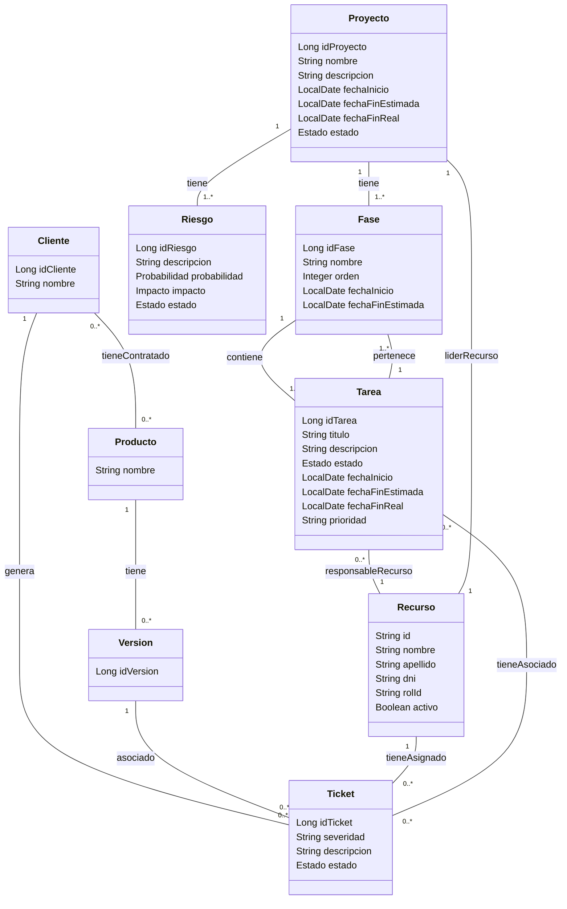

# Modelo de Dominio: Módulo de Soporte + Módulo de Proyectos

## Módulo: Proyectos - Diccionario de Datos

### Entidad: Proyecto

| Campo | Tipo de Dato | Restricciones | Descripción |
|-------|-------------|---------------|-------------|
| idProyecto | Long | PK, obligatorio | Identificador único del proyecto |
| nombre | String | Obligatorio | Nombre del proyecto |
| descripcion | String | Opcional | Descripción general del proyecto |
| fechaInicio | LocalDate | Obligatorio | Fecha de inicio del proyecto |
| fechaFinEstimada | LocalDate | Opcional | Fecha estimada de finalización |
| fechaFinReal | LocalDate | Opcional | Fecha real de finalización |
| estado | Estado | Obligatorio | Estado del proyecto |

### Entidad: Fase

| Campo | Tipo de Dato | Restricciones | Descripción |
|-------|-------------|---------------|-------------|
| idFase | Long | PK, obligatorio | Identificador único de la fase |
| nombre | String | Obligatorio | Nombre de la fase o iteración |
| orden | Integer | Obligatorio | Número de orden de ejecución |
| fechaInicio | LocalDate | Obligatorio | Inicio previsto de la fase |
| fechaFinEstimada | LocalDate | Opcional | Fin estimado de la fase |

### Entidad: Tarea

| Campo | Tipo de Dato | Restricciones | Descripción |
|-------|-------------|---------------|-------------|
| idTarea | Long | PK, obligatorio | Identificador único de la tarea |
| titulo | String | Obligatorio | Título o resumen corto de la tarea |
| descripcion | String | Opcional | Detalle de la tarea |
| estado | Estado | Obligatorio | Estado actual de la tarea |
| fechaInicio | LocalDate | Obligatorio | Fecha de inicio planificada |
| fechaFinEstimada | LocalDate | Obligatorio | Fecha esperada de finalización |
| fechaFinReal | LocalDate | Opcional | Fecha real de finalización |
| prioridad | String | Opcional | Prioridad asignada |

### Entidad: Riesgo

| Campo | Tipo de Dato | Restricciones | Descripción |
|-------|-------------|---------------|-------------|
| idRiesgo | Long | PK, obligatorio | Identificador único del riesgo |
| descripcion | String | Obligatorio | Descripción del riesgo identificado |
| probabilidad | Probabilidad | Obligatorio | Probabilidad de ocurrencia |
| impacto | Impacto | Obligatorio | Impacto potencial del riesgo |
| estado | Estado | Obligatorio | Estado del riesgo |

### Entidad: Recurso

| Campo | Tipo de Dato | Restricciones | Descripción |
|-------|-------------|---------------|-------------|
| id | String | PK, obligatorio | Identificador único del recurso |
| nombre | String | Obligatorio | Nombre del recurso |
| apellido | String | Obligatorio | Apellido del recurso |
| dni | String | Obligatorio | DNI del recurso |
| rolId | String | Obligatorio | Identificador del rol |
| fechaSincronizacion | LocalDateTime | Obligatorio | Fecha de última sincronización |
| activo | Boolean | Obligatorio | Indica si el recurso está activo |

### Relaciones

- **Proyecto** tiene múltiples **Riesgos** (1:N)
- **Proyecto** tiene múltiples **Fases** (1:N)
- **Fase** contiene múltiples **Tareas** (1:N)
- **Recurso** puede ser responsable de múltiples **Tareas** (1:N)
- **Proyecto** tiene un **Recurso** como líder (1:1)

## Módulo: Soporte - Diccionario de Datos

### Entidad: Ticket

| Campo | Tipo de Dato | Restricciones | Descripción |
|-------|-------------|---------------|-------------|
| idTicket | Long | PK, obligatorio | Identificador único del ticket |
| severidad | String | Obligatorio | Nivel de severidad del ticket |
| descripcion | String | Opcional | Descripción detallada del incidente o solicitud |
| estado | Estado | Obligatorio | Estado actual del ticket |

### Entidad: Cliente

| Campo | Tipo de Dato | Restricciones | Descripción |
|-------|-------------|---------------|-------------|
| idCliente | Long | PK, obligatorio | Identificador único del cliente |
| nombre | String | Obligatorio | Nombre de la empresa o cliente |

### Entidad: Producto

| Campo | Tipo de Dato | Restricciones | Descripción |
|-------|-------------|---------------|-------------|
| nombre | String | PK, obligatorio | Nombre del producto |

### Entidad: Version

| Campo | Tipo de Dato | Restricciones | Descripción |
|-------|-------------|---------------|-------------|
| idVersion | Long | PK, obligatorio | Identificador único de la versión |

### Relaciones del Módulo de Soporte

- **Cliente** genera múltiples **Tickets** (1:N)
- **Cliente** tiene contratados múltiples **Productos** (N:M)
- **Producto** tiene múltiples **Versiones** (1:N)
- **Version** está asociada a múltiples **Tickets** (1:N)
- **Recurso** tiene asignados múltiples **Tickets** (1:N)
- **Tarea** está asociada a múltiples **Tickets** (N:M)