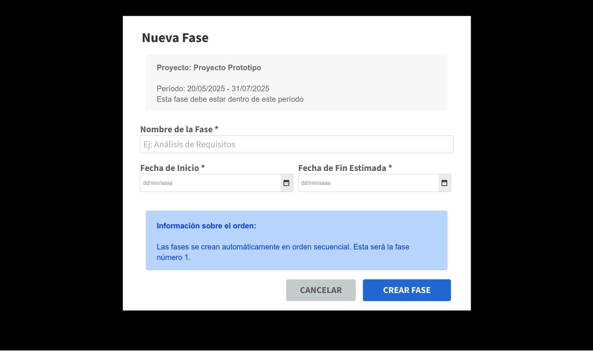

# Prototipo - PSA - Módulo Proyecto

## [Prototipo en Moqups](https://app.moqups.com/9mHbNHLdFKCcvqMBMS3CVyVIp4siIImP/view/page/a0dfc72e5?fit_width=1)

Para el diseño de la interfaz de usuario, se tomaron decisiones creativas en conjunto con el módulo de Soporte para desarrollar una herramienta lo más interactiva y eficaz posible.

A continuación, se detallarán las decisiones tomadas desde la perspectiva del usuario con el flujo orientado al módulo de Proyecto:

- Cuando se ingresa a la página principal se tienen dos botones, uno para dirigirse hacia el módulo de Soporte, y el otro hacia el módulo de Proyectos.

- Al clickear el botón de Proyectos, se redirige hacia los proyectos que se encuentran en la herramienta. En la parte superior izquierda se encuentra un buscador, en el cual se puede ingresar nombres, descripciones o líderes y van apareciendo las opciones que se encuentran guardadas en la herramienta. Luego más a la derecha del buscador, se encuentra el botón para crear un nuevo proyecto.
- En el cuerpo de la página, encontramos cuatro contadores de proyectos, el total, los activos, los pausados y los cerrados.
- Por último, encontramos los proyectos ordenados con toda la información de los mismos.

- Al clickear el botón de Nuevo Proyecto, se redirige a un pop-up en donde se encuentra el espacio para completar toda la información necesaria para crear un nuevo proyecto. Los campos de nombre y descripción se completan de manera tradicional, es decir, tipeando por el teclado. Luego, en las fechas se pueden seleccionar o mismo tipear por teclado. Por otro lado, los líderes se encuentran dispuestos en un desplegable, el cual carga los empleados actuales.

- Luego, se deben completar todos los campos.

- Una vez completados todos los campos, se clickea en el botón Crear Proyecto.

- Al clickear en el botón Crear Proyecto, se redirige hacia la página de proyectos, con el nuevo proyecto creado. Notar los botones de la parte inferior de cada una de las tarjetas de proyecto.

- Al clickear en el botón Ver detalle, se redirige hacia la página del proyecto. En la parte superior derecha se encuentra un botón para volver a la página donde están todos los proyectos. Luego se encuentra toda la información cargada del proyecto junto con laa información que le otorga por default el sistema (como el ID y el progreso general).
- En el cuerpo de la página, encontramos cuatro contadores de fases, de tareas, de riesgos activos y de porcentaje de completado.
- Por último, encontramos tres secciones para redirigirse a las fases, las tareas y los riesgos.

- Si seleccionamos el botón de gestión de fases, nos redirige a la página que tiene la información relevante del proyecto para tener en cuenta en la creación y gestión de fases, junto con cuatro contadores de fases, el total, las completadas, las que se encuentran en progreso y las pendientes. Además, hay dos botones, uno para volver a la página del proyecto, y otro para crear una nueva fase.
- Notar que hay dos botones Nueva Fase. Ambos deben tener la misma acción, tanto en el prototipo como en la implementación.
- En el cuerpo de la página, una vez que se creen las diferentes fases, se encontrarán dispuestas de manera similar a los proyectos en la página inicial del módulo.

- Al clickear el botón de Nueva Fase, se redirige a un pop-up en donde se encuentra la información necesaria del proyecto para crear una nueva fase. El campo del nombre se completa de manera tradicional, es decir, tipeando por el teclado. Luego, en las fechas se pueden seleccionar o mismo tipear por teclado. Luego se clickea en el botón de Crear Fase y queda la fase dispuesta en la página de fases.

- Volviendo a la página del proyecto...

- Si seleccionamos el botón de gestión de tareas, nos redirige a la página que tiene la información relevante del proyecto para tener en cuenta en la creación y gestión de tareas, junto con cinco contadores de tareas, el total, las completadas, las que se encuentran en progreso, las pendientes y las multifase. Además, hay tres botones, uno para ver las fases, uno para volver a la página del proyecto, y otro para crear una nueva tarea.
- Notar que hay dos botones para crear una nueva tarea. Ambos deben tener la misma acción, tanto en el prototipo como en la implementación.
- Además, se encuentra un desplegable para poder aplicarle un filtro a las tareas.
- En el cuerpo de la página, una vez que se creen las diferentes tareas, se encontrarán dispuestas de manera similar a los proyectos en la página inicial del módulo.

- Al clickear el botón de Nueva Tarea, se redirige a un pop-up en donde se encuentra la información necesaria del proyecto para crear una nueva tarea. Los campos del título y descripción se completan de manera tradicional, es decir, tipeando por el teclado. Luego, en las fechas se pueden seleccionar o mismo tipear por teclado. Por otro lado, los responsables se encuentran dispuestos en un desplegable, el cual carga los empleados actuales. Al igual que los responsables, la prioridad se selecciona desde un desplegable. Luego se clickea en el botón de Crear Tarea y queda la tarea dispuesta en la página de tareas.

- Volviendo a la página del proyecto...

- Si seleccionamos el botón de gestión de riesgos, nos redirige a la página que tiene la información relevante del proyecto para tener en cuenta en la documentación y gestión de riesgos, junto con cuatro contadores de riesgos, el total, los activos, los críticos y los mitigados. Además, hay tres botones, uno para ver las tareas, uno para volver a la página del proyecto, y otro para documentar un riesgo.
- Notar que hay dos botones para documentar un riesgo. Ambos deben tener la misma acción, tanto en el prototipo como en la implementación.
- En el cuerpo de la página, una vez que se creen los diferentes riesgos, se encontrarán dispuestas de manera similar a los proyectos en la página inicial del módulo.

- Al clickear el botón de Documentar Riesgo, se redirige a un pop-up en donde se encuentra el nombre del proyecto en el cual se documentará un riesgo. Los campos de descripción y plan de mitigación se completan de manera tradicional, es decir, tipeando por el teclado. Luego, tanto la probabilidad y el impacto se seleccionan desde un desplegable. Luego se clickea en el botón de Documentar Riesgo y queda el riesgo dispuesta en la página de riesgos.

